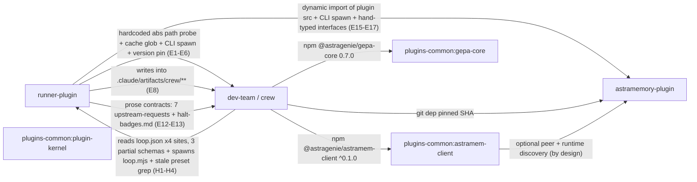

# Cross-Repo Consolidation Review — Phase 2 Findings

> Synthesized 2026-07-07 from `...-phase1-evidence.md` (workflow `wf_f9c35878-885`, 12 agents).
> Verdicts are cross-repo comparisons only the synthesizer sees. Citation spot-check:
> 4 verifier agents sampled ≥20% of citations per repo (116 of 591 unique); results
> recorded in the "Citation verification" section at the bottom.
> Prompt: `2026-07-07-cross-repo-consolidation-review-prompt.md`. Phase 3 plan is a
> separate artifact.

---

## 1. Scorecard

1–5. 3 = typical unreviewed internal code. No inflation.

| Dimension | runner-plugin | dev-team | astramemory-plugin | plugins-common |
|---|---|---|---|---|
| Duplication hygiene | **2** — canonical helpers exist and are bypassed at scale (13 files bypass `resolveConfig`, 22 bypass `paths.mts`, 4 re-introduce the CRLF frontmatter bug the canonical parser fixed) | **1.5** — 11 diverged frontmatter parsers, 10 hand-rolled JSONL appends with zero shared append helper, byte-identical `runGit` in two files | **2** — every CLI entry point exists in 2–3 parallel forms (`.ts` / `.mjs` / extensionless), 5 lib twin-pairs, `fetchWithTimeout` duplicated verbatim across providers | **2.5** — 5 independent fetch clients in one package, `parseChatResponse` duplicated, provider enum duplicated in one file and it already caused a live bug (`de7dc45`) |
| Dependency graph / boundaries | **2** — 6+ undeclared edge types into crew incl. hardcoded `C:/work/mega/hero-crew` path and writes into crew's artifact namespace | **2.5** — proper npm deps on plugins-common (good) but 4 independent readers of runner's `loop.json` with 3 partial schemas, mirror-by-comment modules, stale preset-path grep | **4.5** — zero coupling to sibling repos; one type-only layer inversion | **4.5** — workspace-only edges, no cross-package imports, no path escapes |
| Exception handling | **2** — ~89% of 369 catches swallow silently; 12 error classes with no shared base; `result.mts` has zero production importers | **4** — 17% swallow rate, documented Result policy actually followed (throw-inside/convert-at-boundary, no leaks found), classes asserted in tests | **4** — real 2-class taxonomy + consistent layering (lib throws typed, CLI returns exit codes); minus: parallel ad-hoc `exitCode`-tagged idiom in the Clerk path, `memory-token.ts` exits at module scope | **2** — zero error classes, 21/24 catches swallow, `file-store.put()` leaks uncaught `ZodError`, `LockManager.acquire()` throws despite a documented never-throws contract |
| Provider / integration seams | **2** — three astramem transports coexist, none of them `astramem-client`; single-seam rule violated in the repo that co-authored it | **4** — astramem via shared package with explicit "never hand-rolls" header; judge providers behind a registry interface | **2.5** — four seams to its own backend; `.mcp.json` bypasses the selector and wire-probe entirely; shipped slash commands shell out instead of using the plugin's own MCP server | **3.5** — `astramem-client` is the ecosystem's one exemplary seam; `BinaryDispatcher`/`JudgeRegistry` are real DI; below the interface, 5 bespoke HTTP clients (one with no timeout at all) |
| DI & testability | **3** — singleton+reset-seam pattern is consistent; one import-time FS stat (`plugin-identity.mts:14-21`); 248 real-FS test files, zero mocking | **4** — parameter-passing dominant, factory registry, narrow documented test seams, no import-time side effects | **3** — three non-interoperating patterns; un-injectable `datadir` forces env monkeypatching AND whole-module `vi.mock`; the shared provider contract suite is genuinely good | **4.5** — factory functions, constructor-injected config, `check-no-env-reads` CI gate, no import-time side effects |
| Bad-practices hygiene | **2** — 272 `: any` + 470 `Record<string, any>` in non-test code; 78 artifact-path literals across 45 files; CLAUDE.md contradicts itself on the slice-command surface; zombie codemod tool | **3** — near-zero `any` (2), zero ts-ignore; but 52 artifact-path literals across 36 files and a features-service that silently enables typo'd flag names | **2.5** — strict TS, zero `any`; but 4 env-var prefix families violating its own "single source of truth" registry, and the product name is spelled 4 ways *including two different on-disk data directories* | **3.5** — clean types; `Opts`-vs-`Options` naming split, groq rate-limit parser permanently fed empty `Headers`, one CI gate script has no test |
| Toggles / config | **2.5** — formal 8-flag registry coexists with ≥15 unregistered raw config toggles; three separate `>0 ? raw : DEFAULT` silent-fallback traps | **2.5** — four config surfaces in one repo (`crew.json`, `gepa.config.json`, `models.yaml`, plus runner's `loop.json`), env escape hatches parallel to the registry, double-gated toggles | **3** — `env-specs.ts` registry is the right idea, bypassed by its own repo 3 times; per-hook-event budget toggles triplicated | **3.5** — `GepaConfigSchema` (zod, typed defaults) is the best toggle mechanism in the ecosystem; astramem-client's raw env reads are a second mechanism in the same monorepo |

**One healthy sentence per repo (quota: one).** runner-plugin: exit-code discipline in `lib/` is genuinely clean and its canonical helpers are well-built — the problem is adoption, not construction. dev-team: its error handling and seam discipline are the model the rest should converge on. astramemory-plugin: its typed-error taxonomy and CLI/lib layering are the cleanest in the ecosystem. plugins-common: its DI and CI-gate hygiene are exactly what a shared package needs.

---

## 2. Dependency graph

### Current (evidence-backed edges only)



No edge at all: runner-plugin → plugins-common (zero — `package.json` deps are `ajv`, `ajv-formats` only), astramemory-plugin → anything, plugin-kernel → anything (empty scaffold), package → package inside plugins-common.

### Edge table (defects only; full inventory in Phase 1)

| # | Edge | Mechanism | Verdict | Evidence |
|---|---|---|---|---|
| E1 | runner → crew | Hardcoded absolute path `C:/work/mega/hero-crew/scripts/crew.mjs` probed before plugin cache | **BLOCKER-class coupling** — breaks on any other machine layout; also the repo is named `dev-team` on this machine, so the first probe can never hit | `runner-plugin/src/scripts/lib/slice-linker/crew-bridge.mts:23-53` |
| E8 | runner → crew | 9+ runner modules read/write `.claude/artifacts/crew/**`, a namespace runner does not own | MAJOR — schema drift lands silently at runtime | `cost-alert-loader.mts:4-5`, `ceremonies.mts:119,134`, `grade-writer.mts:415`, others |
| E15-17 | runner → astramem | Dynamic `import()` of the plugin's own `src/lib/selector.ts` + CLI spawn fallback + hand-typed structural interfaces "not compiled against" | MAJOR — this is exactly what `astramem-client` was built to replace; interfaces drift with zero compile-time signal | `memory-transport.mts:34-52,82-123`, `memory-bridge.mts:104-172` |
| H1 | dev-team → runner | 4 independent `loop.json` readers, 3 different partial Zod/ad-hoc schemas | MAJOR — schema negotiation happens in comments and a research doc, not code | `resolve-model.ts:1-28`, `memory/inject-recall.ts:30,46-55`, `memory/schema.ts:6-10`, `cost-watch.ts:112-115` |
| H2 | dev-team → runner | `orchestrate-slice.md` Step 2.5 greps runner's superseded `scripts/presets/*.json` path | MAJOR (known, DEC-069 fallout) — command silently resolves against a path that no longer exists post-FEAT-218 | `dev-team/commands/orchestrate-slice.md:139-163` |
| H3 | dev-team → runner | `resolve-model.ts` / `feature-flag-lite.ts` are deliberate hand-mirrors with "mirror the change here too" comments; sync enforced only by a parity test in one case, by nothing in the other | MAJOR — mirror-by-comment is the pattern this review exists to kill | `resolve-model.ts:1-28`, `feature-flag-lite.ts:15` |
| I1 | astramem internal | `src/lib/pending.ts:44` type-imports from `src/cli/ingest-transcript.ts` (lib → entry inversion, type-only) | MINOR | `pending.ts:44` |

### Desired graph — allowed-edge rules

1. plugins-common packages import **nothing** from plugin repos, ever (holds today; keep as CI assertion).
2. Any repo touching astramem does it through `@astragenie/astramem-client` — no dynamic imports of plugin source, no CLI spawns, no hand-typed provider interfaces. (dev-team complies; runner does not.)
3. A config file read by ≥2 repos gets one schema package; consumers import the schema, never re-derive it. (`loop.json` is the violation; `crew.json` is next if anything else starts reading it.)
4. No repo writes into another repo's artifact namespace without a schema-versioned contract. `.claude/artifacts/crew/**` writes from runner either move behind a crew CLI call or get a shared schema.
5. Version pins (`MIN_CREW_VERSION`) stay, but resolution never uses hardcoded absolute paths — env var + plugin cache only. Delete the `C:/work/mega/hero-crew` probe.
6. Mirror-by-comment is banned. If two repos need the same logic, it is a package or it is one repo's exported CLI verb — never a comment saying "keep in sync."

---

## 3. Findings (severity-tagged)

### BLOCKER

- **B1 — The consolidation target has the worst error discipline in the ecosystem.** plugins-common ships zero custom error classes, swallows 21/24 catches, mixes `.parse`/`.safeParse` for the same question, and has two contract violations: `fileStore().put()` can reject with an uncaught `ZodError` (`file-store.ts:46`) while every read path swallows, and `LockManager.acquire()` propagates non-`EEXIST` FS errors out of a function documented as returns-null-never-throws (`file-lock-manager.ts:54-65,126`). Anything consolidated *into* this repo inherits this. Fix the target before moving code into it.
- **B2 — runner-plugin's astramem access violates the single-seam decision it co-owns.** Three transports (in-process dynamic import of plugin source, CLI spawn, hand-typed interfaces with an explicit "not compiled against" disclaimer) and zero use of `astramem-client` (`memory-transport.mts:34-52`; repo-wide grep 0 matches). The landing chain to fix this is already planned (memory: `astramem-client` chain 2026-07-07) — this finding is the evidence for why it must not slip.
- **B3 — Hardcoded absolute path as the *primary* crew resolution strategy** (`crew-bridge.mts:39`): `C:/work/mega/hero-crew/...` is probed before the plugin cache, on a machine where the checkout is named `dev-team`. Dead code on this machine, wrong code on every other.

### MAJOR

- **M1 — Frontmatter parsing is an ecosystem-wide bug factory.** runner: canonical CRLF-tolerant parser (fan-in 36) + 5 hand-rolled regexes of which 4 are LF-only — the exact bug class the canonical parser documents fixing (`crew-bundle-parser.mts:64`, `wave/*.mts`). dev-team: **11** independent parsers, diverged regex shapes, zero shared module. On a Windows-first ecosystem, LF-only frontmatter regexes are latent data-loss bugs, not style nits.
- **M2 — JSONL handling: one good implementation, seventeen-plus rogue ones.** runner's `jsonl-append.mts` (119 LOC, 8 importers, 1 touch in 3 months — the most stable shared-util candidate found) vs 8 hand-rolled sites in runner, 10 in dev-team (zero shared append), astramem's own rotation-capable `log.ts`, gepa-core's `readJsonlSafe`. Two swallow disciplines for the same torn-line condition inside one package (`file-store.ts:25-27` silent vs `validate-trial-corpus.ts:72` counted).
- **M3 — Config-read anarchy.** runner: 13 files bypass `resolveConfig` with raw `readFile`+`JSON.parse`. dev-team: 4 more readers of the same file (another repo's file), 3 partial schemas. 24 + 53 ad-hoc `config?.x?.y ?? default` chains in runner/dev-team respectively. There is no single place where a typo'd config key becomes an error in any repo.
- **M4 — Two feature-flag registries already declare their own merge.** `runner-plugin/src/scripts/lib/features-service.mts:12-14` states it "mirrors crew's sibling registry ... so the two registries can merge into one kernel service in Phase 2." dev-team's `features-service.ts` silently enables unregistered flag names (`:162` — `?? true` on a typo). Both repos ALSO ship a `feature-flag-lite` hook-side mirror kept in sync by a parity test (dev-team) or nothing (runner's 4 hook `.mjs` files vs the documented 2). This is the single most explicitly pre-declared extraction in the ecosystem.
- **M5 — Silent-fallback config traps are a pattern, not an incident.** runner: 3 sites where `0`/negative silently reverts to default (`marathon-checkpoint.mts:44-48`, `redundant-read-detector.mts:60-69`, `failure-classifier.mts:79`). dev-team: typo'd feature name → enabled. astramem: `MEMORY_DEPRECATION_OPT_OUT` silences the warning but keeps using the deprecated alias (`env.ts:72-85`). Three repos, same disease, three shapes.
- **M6 — astramem plugin bypasses its own abstraction.** `.mcp.json` points straight at `${MEMORY_API_URL}/mcp` with a raw bearer template — no selector, no wire-probe, no scrub path — while the shipped `/recall`/`/remember` commands shell out to the CLI instead of using that MCP server. One backend, four seams, two of them contradicting each other.
- **M7 — `any` debt is a runner-only problem and it is large.** 272 `: any` + 470 `Record<string, any>` + 111 `any[]` in non-test code, plus the zombie `codemod-add-any.mts` that mass-inserted them and was never deleted after the two tsconfig-tightening commits landed. Every other repo is at 0–2 occurrences. This is migration debt with a named origin, not organic decay.
- **M8 — Dead weight survives audits.** runner: 51 dead exports, 7 of which were named for deletion in a 2026-06-15 audit and are all still present 22 days later. astramem: 4 extensionless `bin/` originals with zero references. dev-team: 9 dead exports. Audit findings without enforcement don't converge.
- **M9 — plugin-kernel is an empty scaffold with framework ambitions.** 26 lines, `export {}`, one smoke test, and a docblock promising to own workflow-state "wholesale," locks, ID minting, and a typed-event spine — while dev-team's `workflow-state.ts` (the thing to be moved) churned 11×/3mo and gepa-core *already ships* a lock manager. Two lock implementations are planned where one exists. The kernel's referenced design doc doesn't exist in the repo.

### MINOR

- **m1** — astramem product-name spelling drives two different on-disk data dirs (`%APPDATA%\Astramem` via `datadir.ts:23` vs `~/.astramemory` via `profileResolver.ts:18`) resolved by two unrelated modules with no shared helper.
- **m2** — `Opts` vs `Options`/`CallOptions` naming split between gepa-core and astramem-client; 19:1 `opts:` vs `options:` parameter naming.
- **m3** — groq provider's rate-limit parser is permanently fed `new Headers()` (`groq/index.ts:77`) — dead feature shipped as if live; `generic-openai` (and thus groq) has no request timeout at all (`generic-openai/index.ts:64-90`).
- **m4** — runner CLAUDE.md self-contradiction: HARD RULES section mandates `/runner:slice start|complete`, a command surface line 349 says was renamed to `/runner:start`+`/runner:close`.
- **m5** — dev-team `crew.ts`: 46-command dispatch table, 57 dynamic imports, ~25 unrelated subsystems, no grouping layer. runner `loop.mts`: same shape, 1927 lines, 96 imports, 7 inline domains. Both CLI entry points are the god objects of their repos.
- **m6** — `_ingest` env-var registry (`env-specs.ts`) violated by its own repo 3× (`ASTRAMEMORY_ENV`, `ASTRAMEMORY_HOME`, `ASTRAM EM_HOOK_DEBUG` never registered).

---

## 4. Convention verdicts

One convention per axis. Seed named; sketch is interface-level only.

### 4a. Exception handling → adopt dev-team's policy, astramem's taxonomy

dev-team is the only repo whose Result/throw split is documented AND followed (`result.ts:1-9` policy header; boundary-conversion verified with no leaking counter-example). astramem has the only real error taxonomy (`DeterministicError`/`TransientError` + one subclass). Merge the two into a tiny plugins-common module:

```ts
// @astragenie/plugin-std — errors.ts (sketch)
export abstract class PluginError extends Error {
  abstract readonly code: string;          // stable, machine-readable
  readonly transient: boolean = false;     // retry-safe?
}
export class TransientError extends PluginError { readonly transient = true; ... }
export class DeterministicError extends PluginError { ... }

// result.ts — dev-team's result.ts verbatim, policy header included:
// Result for validation/expected failures; throw (typed) for infrastructure;
// convert at the function boundary, never leak a throw from a Result-typed fn.
export type Result<T, E = PluginError> = { ok: true; value: T } | { ok: false; error: E };
```

Rules that ride along: every intentional swallow gets a counter or a structured-log line (the `tornLines` pattern, not the `file-store` silent-drop pattern); `.safeParse` always, `.parse` never, at IO boundaries; swallow-with-comment is only acceptable in hook shims whose contract is "never block Claude."

### 4b. DI → adopt gepa-core's pattern

Factory functions taking explicit `(root | config | deps)` parameters, returning closure-scoped instances; no module-scope state except memoized resolvers with test-gated reset seams (the `_setX`/`_resetX` + `isTestEnv()` idiom already independently converged in runner, astramem, and astramem-client — bless it, don't fight it); zero import-time I/O, enforced by generalizing `check-no-env-reads.ts` into a `check-no-import-side-effects` gate each repo can run. The one known offender to fix: `plugin-identity.mts:14-21` (import-time `existsSync`) and `bin/memory-token.ts` (spawn + exit at module scope).

### 4c. Toggles/config → adopt gepa-core's zod-schema mechanism + registry semantics

One pattern: a zod schema with typed defaults per config surface (`GepaConfigSchema` shape), wrapped in an accessor that (a) **rejects unknown keys loudly** (kills dev-team's typo-enables-flag trap), (b) distinguishes "explicitly disabled" from "absent" (kills runner's `0`-means-default trap), (c) logs deprecated-alias use even when warnings are opted out (kills astramem's opt-out trap).

```ts
// @astragenie/plugin-std — flags.ts (sketch)
export function defineFlags<S extends z.ZodObject>(schema: S, opts?: { onUnknownKey: "throw" | "warn" }) {
  return { read(raw: unknown): z.infer<S>; isEnabled(name: keyof z.infer<S>): boolean; };
}
```

The merge of runner's and dev-team's features-service registries into this is pre-authorized by runner's own file header (`features-service.mts:12-14`).

---

## 5. Package boundary reassessment

- **astramem-client** — correctly shaped, correct size, one consumer (dev-team) of a potential three. Verdict: keep as-is; the work is adoption (runner), not reshaping.
- **gepa-core** — two packages wearing one name: (a) GEPA domain (trial store, scorer, judge providers, drift/pareto) and (b) generic infra (file-lock-manager, daily-cap-meter) that has nothing GEPA-specific. The infra half overlaps plugin-kernel's stated plan ("one lock implementation shared by both plugins"). Verdict: don't split yet (7 version bumps in 11 days — churning), but freeze the boundary: new generic infra does NOT land in gepa-core.
- **plugin-kernel** — would not exist in a greenfield design (see Phase 3). An empty package whose docblock promises a framework (wholesale state-machine adoption, lifecycle authority) is exactly the "accidental framework" failure mode. Verdict: either repurpose as the small-utils package (`plugin-std` above) with library semantics — importable piecemeal, no lifecycle, no IoC — or delete and create honestly-named packages. Do not implement the docblock as written while `workflow-state.ts` churns 11×/3mo.
- **Diseases already inside the target**: error-style disagreement between astramem-client (fail-silent by design, fine) and gepa-core (fail-silent by accident, contract-violating — B1); two toggle mechanisms; `Opts`/`Options` split. plugins-common needs its own conventions doc + CI gates before absorbing anything.

---

## 6. Citation verification (spot-check)

4 haiku verifiers, 115 citations checked (≥20% per repo, seeded random sample). Result:
**every sampled citation verified FOUND**; verifier descriptions of what sits at each
location match the evidence's claims.

| Repo | Sampled | FOUND | WRONG_LINE | NOT_FOUND |
|---|---|---|---|---|
| runner-plugin | 31 | 31 | 0 | 0 |
| dev-team | 40 | 40 | 0 | 0 |
| astramemory-plugin | 23 | 23 | 0 | 0 |
| plugins-common | 21 | 21 | 0 | 0 |

Reconciliation notes (none finding-invalidating):

- `astramem-client/src/resolve.ts:118-120` and `:70-71` — code verified present but the
  described construct sits a few lines from the evidence's citation ("fall through to
  saas" swallow vs `candidateRoots()` end; `_resetResolveCache` vs `isTestEnv()` start).
  Line-offset drift only; the 4-swallowed-catches finding holds.
- Evidence's `ASTRAM EM_PROVIDER` (stray space) is a Phase 1 transcription typo; the
  real env var is `ASTRAMEM_PROVIDER` (`env-specs.ts:55-58`, verified).
- Key load-bearing citations independently confirmed verbatim: the hardcoded
  `HERO_CREW_PATH`/hero-crew resolution (B3 area), `MIN_CREW_VERSION = "0.48.0"`,
  `result.mts` full contents (dead helper, B/M evidence), dev-team's
  `@astragenie/astramem-client` import (the exemplar seam), the LF-only
  `FRONTMATTER_RE` in `wave/touches-files.mts:4` (M1), and both `datadir.ts`
  spelling-divergent data dirs (m1).

Phase 2 findings stand as written; Phase 3 may rely on them.
